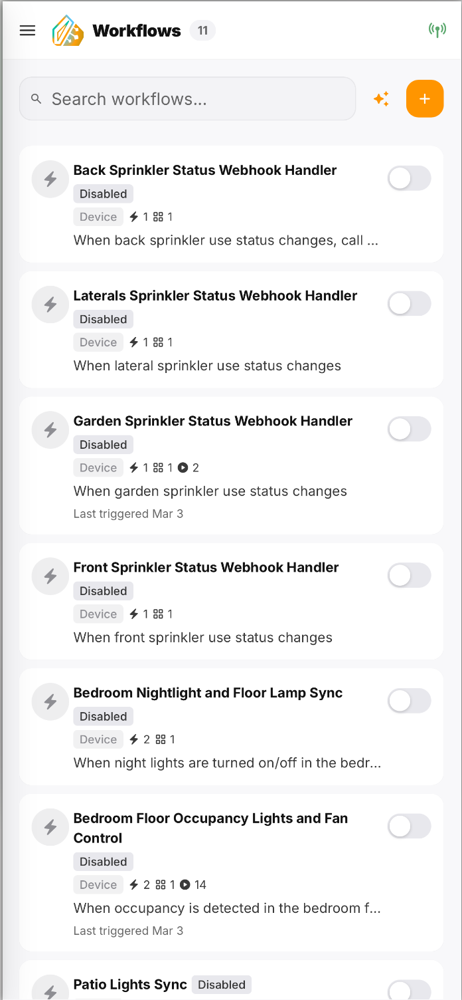
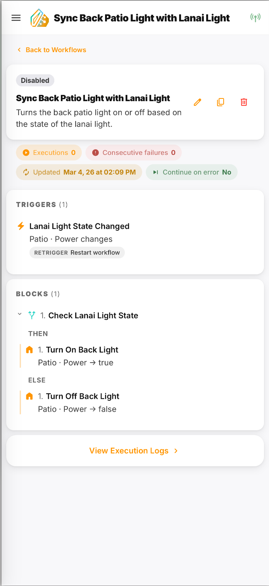
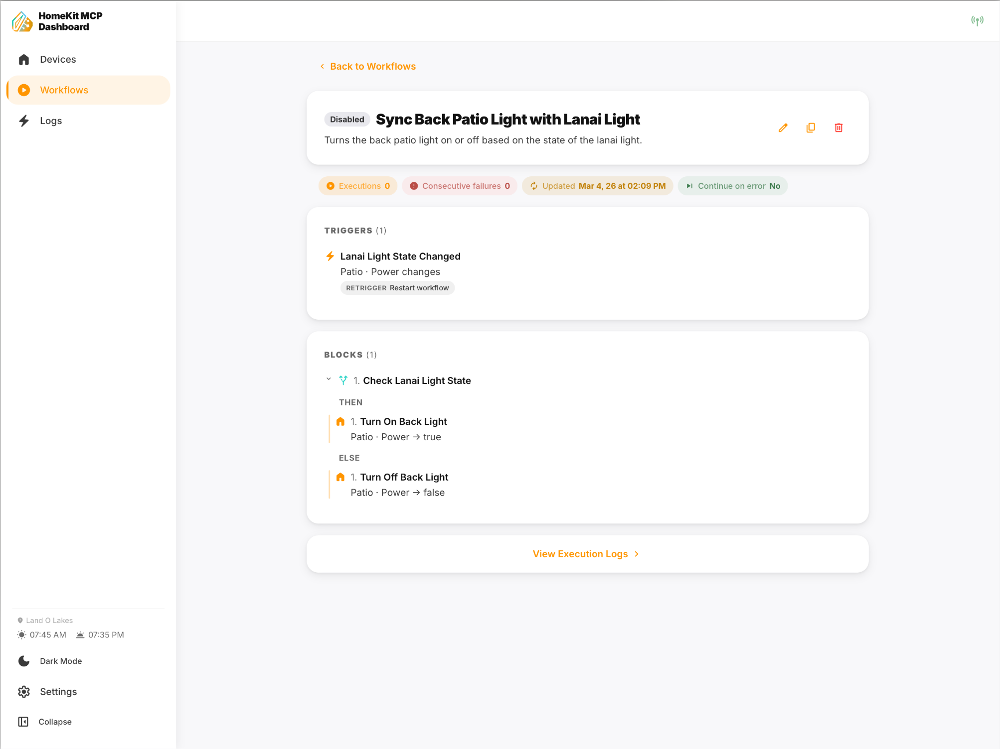
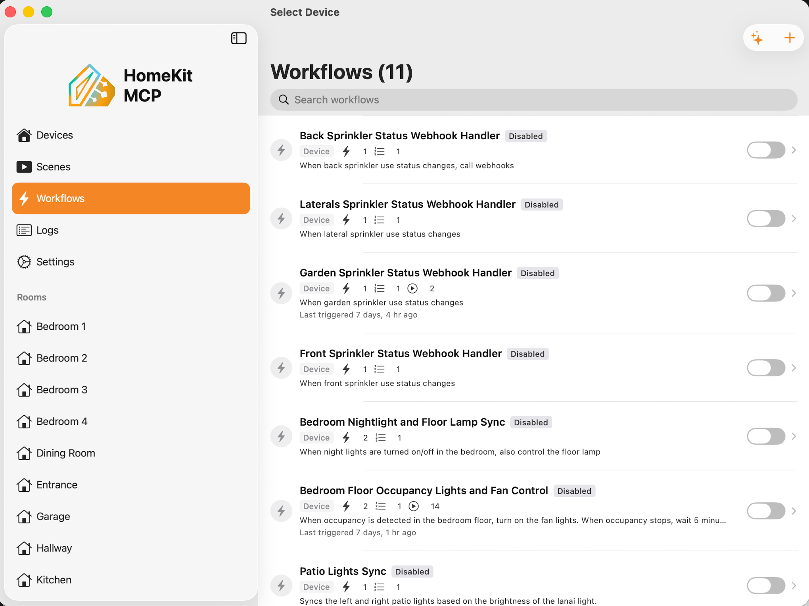
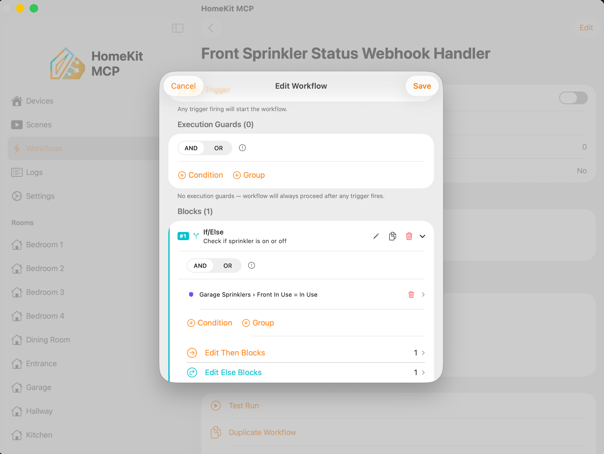
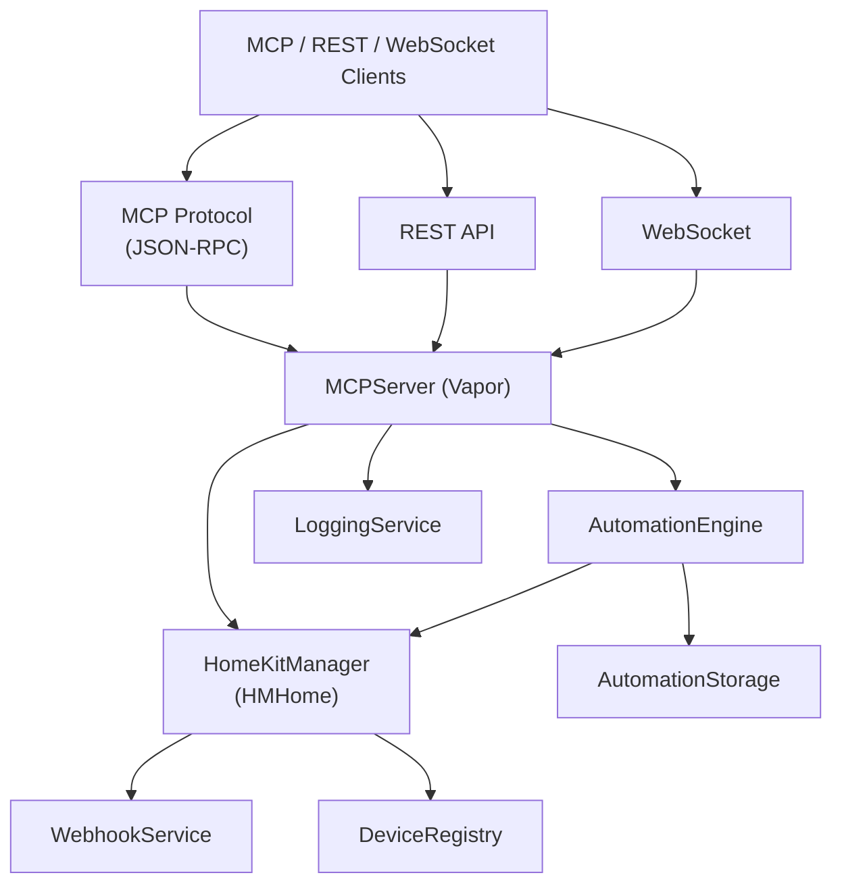

<p align="center">
  
</p>

<h1 align="center">CompAI - Home</h1>
<h3 align="center">AI Companion for Apple HomeKit</h3>

<p align="center">
A macOS menu bar app that exposes your Apple HomeKit devices through the <a href="https://modelcontextprotocol.io">Model Context Protocol (MCP)</a>. Connect AI assistants like Claude to your smart home — query device states, control accessories, create automations, and receive real-time updates when things change.
</p>

---

## Screenshots

### Web Dashboard

The companion web dashboard provides a responsive interface that adapts from mobile to desktop layouts.

<p align="center">
  
  &nbsp;&nbsp;
  
  &nbsp;&nbsp;
  
</p>

<p align="center"><em>Mobile layout — Device list, automations, and real-time Activity Log with room tags and state change details.</em></p>

<br/>

<p align="center">
  
  &nbsp;&nbsp;&nbsp;
  
</p>

<p align="center"><em>automation detail view — mobile (left) and desktop (right) showing triggers, conditional blocks with then/else branches, execution stats, and the sidebar navigation.</em></p>

### Native macOS App

The Mac Catalyst app runs in the menu bar and provides full device management, automation editing, server configuration, and activity logging.

<p align="center">
  
  &nbsp;&nbsp;
  
</p>

<p align="center"><em>automations list with room-based sidebar navigation (left). Visual automation editor with execution guards, conditional blocks, and inline editing (right).</em></p>

<br/>

<p align="center">
  
  &nbsp;&nbsp;
  
</p>

<p align="center"><em>Server settings — port, CORS origins, binding interface, and API token management (left). Activity logs with device, room, and service type filters (right).</em></p>

---

## Features

- **MCP Server** — JSON-RPC over Streamable HTTP and legacy SSE, exposing device resources, control tools, and automation tools
- **REST API** — Full HTTP REST interface for devices, scenes, logs, and automations
- **Real-time monitoring** — Observes HomeKit accessory state changes via `HMAccessoryDelegate` with optional polling fallback
- **Device control** — Turn lights on/off, adjust brightness, set thermostats, lock/unlock doors, and more
- **Scene support** — List and execute HomeKit scenes
- **automation** — Create, manage, and execute automations with triggers (device state, schedule, sun events, webhooks), conditions (device state, time, scene), and action blocks (device control, delays, conditionals, loops, groups, HTTP calls, scene execution, sub-automation calls)
- **AI automation generation** — Generate automations from natural language using Claude, OpenAI, or Gemini
- **WebSocket push** — Real-time broadcast of log entries, automation executions, and device updates to connected clients
- **Webhook notifications** — HTTP POST callbacks on state changes with HMAC-SHA256 signing and exponential backoff retry
- **State logging** — Configurable circular buffer of activity logs (state changes, API calls, webhook events, automation executions), persisted to disk
- **iCloud sync** — Optional CloudKit-based automation sync and backup across devices
- **Stable device IDs** — App-generated stable identifiers that survive HomeKit re-pairing
- **Per-characteristic access control** — Configure which characteristics are exposed externally and to webhooks
- **Multi-token auth** — Multiple Bearer tokens for different clients, stored in Keychain
- **Web dashboard** — Companion React web app for viewing logs, managing automations, and monitoring devices (see [webclient/](webclient/))
- **Menu bar app** — Runs unobtrusively in the macOS menu bar (no Dock icon)

## Requirements

- macOS 13.0 (Ventura) or later
- Xcode 16+
- [XcodeGen](https://github.com/yonaskolb/XcodeGen) (`brew install xcodegen`)
- Node.js 22+ (for the web dashboard)
- HomeKit-compatible accessories configured in the Apple Home app
- An Apple Developer account (for HomeKit entitlement)

## Quick Start

```bash
# Generate the Xcode project from project.yml
make generate

# Build and launch in dev mode (auto-accepts a default auth token)
make dev

# Install web dashboard dependencies & start dev server
make web-install
make web-dev
```

In **dev mode**, the bearer token `dev-token-compai-home` is automatically accepted — no manual Keychain setup needed.

## Make Commands

| Command | Description |
|---------|-------------|
| `make help` | Show all available commands |
| `make generate` | Generate the Xcode project from `project.yml` |
| `make dev` | Build and launch in **Dev** mode (auto-accepts dev token) |
| `make dev-all` | Build and run **both** apps in Dev mode, opens browser |
| `make prod` | Build and launch in **Prod** mode (requires real Keychain tokens) |
| `make test` | Run all tests (Swift + web) |
| `make test-swift` | Run Swift unit tests only |
| `make test-web` | Run web unit tests only |
| `make web-dev` | Start the web dashboard dev server |
| `make web-build` | Build the web dashboard for production |
| `make web-prod` | Build and run web dashboard via Docker |
| `make web-install` | Install web dashboard npm dependencies |
| `make clean` | Clean Xcode build artifacts |
| `make kill` | Kill running CompAI-Home process |

## Build Configurations

The project uses [XcodeGen](https://github.com/yonaskolb/XcodeGen) (`project.yml`) with four build configurations:

| Configuration | Scheme | Use Case |
|---------------|--------|----------|
| **Dev Debug** | `CompAI-Home` | Local development with debugger (`make dev`) |
| **Dev Release** | `CompAI-Home` | Optimized dev build |
| **Prod Debug** | `CompAI-Home-Prod` | Production behavior with debugger (`make prod`) |
| **Prod Release** | `CompAI-Home-Prod` | Distribution build |

**Dev** builds compile with the `DEV_ENVIRONMENT` flag, which injects a well-known dev token (`dev-token-compai-home`) so you don't need to configure Keychain tokens during development.

**Prod** builds behave like the final app — tokens must be created and stored in the Keychain through the app's settings UI.

## Testing

```bash
# Run all tests (Swift + web)
make test

# Swift tests only (DeviceRegistryService, etc.)
make test-swift

# Web tests only (Vitest)
make test-web

# Web tests in watch mode
cd webclient && npm run test:watch
```

## Subscription Testing

The app uses StoreKit 2 auto-renewable subscriptions to gate Pro features (automations, AI assistant, web dashboard). Two approaches are available for testing:

### Debug Override (for `make dev`)

Since `make dev` runs outside Xcode's debugger, StoreKit sandbox products aren't available. Use the debug override to switch tiers:

```bash
# Enable Pro tier
defaults write com.mnplab.compai-home subscription.debugOverrideTier pro

# Switch back to Free tier
defaults delete com.mnplab.compai-home subscription.debugOverrideTier
```

Restart the app after changing. This override is `#if DEBUG` only and stripped from release builds.

### StoreKit Configuration (for Xcode)

To test the actual purchase flow (product listing, payment sheet, restore purchases):

1. Open `CompAI-Home.xcodeproj` in Xcode
2. Edit scheme → Run → Options → set **StoreKit Configuration** to `CompAI-Home-StoreKit.storekit`
3. Run with **Cmd+R**
4. Use **Debug → StoreKit → Manage Transactions** to delete, expire, or refund transactions for repeated testing

The StoreKit configuration defines two products:

| Product ID | Type | Price |
|------------|------|-------|
| `com.mnplab.compai_home.pro.monthly` | Monthly auto-renewable | $4.99 |
| `com.mnplab.compai_home.pro.yearly` | Yearly auto-renewable | $39.99 |

## CI/CD

GitHub Actions runs automatically on every push and PR to `main`:

- **Swift job** (macOS): generates project via XcodeGen, builds, runs unit tests
- **Web job** (Ubuntu): TypeScript type-check, Vitest tests, production build

See [.github/workflows/ci.yml](.github/workflows/ci.yml) for details. GitHub Actions is free for public repositories and includes 2,000 minutes/month for private repos on the free tier.

## Getting Started (Manual)

### Build

```bash
xcodebuild -scheme CompAI-Home -destination 'platform=macOS,variant=Mac Catalyst' build
```

Or open `CompAI-Home.xcodeproj` in Xcode and build with **Cmd+B**.

### Run

1. Launch the app — it appears as an icon in the menu bar
2. Grant HomeKit access when prompted
3. The MCP server starts automatically on `localhost:3000`

### Connect an MCP Client

Point any MCP-compatible client at:

```
http://localhost:3000/mcp       # Streamable HTTP (recommended)
http://localhost:3000/sse        # Legacy SSE (2024-11-05)
```

Authentication is required for all endpoints except `/health`. Configure Bearer tokens in the app's Server Settings.

## Configuration

Settings are available in the app's Settings view:

### General

| Setting | Default | Description |
|---------|---------|-------------|
| Hide Room Name | `true` | Strip room prefix from device display names |
| Temperature Unit | Celsius | Display temperatures in Celsius or Fahrenheit |

### Server

| Setting | Default | Description |
|---------|---------|-------------|
| Enable External Access | `true` | Start/stop the MCP and REST server |
| MCP Server Port | `3000` | HTTP port for the MCP and REST server |
| Bind Address | `127.0.0.1` | Network interface to listen on (`127.0.0.1` or `0.0.0.0`) |
| MCP Protocol | `true` | Enable MCP JSON-RPC endpoints (`/mcp`, `/sse`) |
| REST API | `true` | Enable REST endpoints (`/devices`, `/automations`, etc.) |
| WebSocket | `true` | Enable real-time WebSocket push at `/ws` |
| CORS | `true` | Enable CORS headers with configurable allowed origins |
| API Tokens | — | Manage multiple Bearer tokens for authentication |

### Webhooks

| Setting | Default | Description |
|---------|---------|-------------|
| Enable Webhooks | `true` | Send HTTP POST on device state changes |
| Webhook URL | — | Destination URL for webhook notifications |
| Private IP Allowlist | — | Wildcard patterns for allowed private IPs |

### Logging

| Setting | Default | Description |
|---------|---------|-------------|
| Device State Logging | `true` | Log HomeKit state changes |
| Detailed Logs | `false` | Log full request/response JSON bodies |
| Log Access via API | `true` | Expose logs through MCP `get_logs` tool and REST `/logs` endpoint |
| Log Skipped automations | `true` | Log automation executions that were skipped (e.g. guard conditions not met) |
| Log Only Webhook Devices | `false` | Only log changes for webhook-configured devices |
| Log Buffer Size | `500` | Maximum number of log entries to keep in memory (100–5000) |

### automations

| Setting | Default | Description |
|---------|---------|-------------|
| Enable automations | `true` | Enable the automation engine |
| iCloud Sync | `false` | Sync automations across devices via CloudKit |
| Sun Event Location | — | Zip/postal code for sunrise/sunset calculations |

### AI Assistant

| Setting | Default | Description |
|---------|---------|-------------|
| Enable AI | `false` | Enable AI-powered automation generation |
| AI Provider | Claude | LLM provider (Claude, OpenAI, or Gemini) |
| Model ID | — | Specific model to use (auto-detected per provider) |
| API Key | — | Provider API key (stored in Keychain) |
| System Prompt | — | Custom instructions for AI automation generation |

### Account & Backup

| Setting | Default | Description |
|---------|---------|-------------|
| Sign In with Apple | — | Apple ID authentication for cloud features |
| Auto-Backup to iCloud | `false` | Automatically back up automations to CloudKit |
| Backup Frequency | `24h` | Hours between automatic backups (1–48) |

### Polling

| Setting | Default | Description |
|---------|---------|-------------|
| Enable Polling | `false` | Poll for state changes as a fallback to delegate callbacks |
| Polling Interval | `30s` | Seconds between poll cycles (10–300) |

---

## MCP API

The server implements the [Model Context Protocol](https://modelcontextprotocol.io) with both Streamable HTTP (2025-03-26) and legacy SSE (2024-11-05) transports.

### Resources

| URI | Description |
|-----|-------------|
| `homekit://devices` | JSON array of all HomeKit devices with current states |
| `homekit://scenes` | JSON array of all HomeKit scenes with their actions |

### Device Tools

| Tool | Description |
|------|-------------|
| `list_devices` | List all devices grouped by room with optional room/category filters |
| `get_device_details` | Get detailed state of one or more devices by ID |
| `control_device` | Set a characteristic value on a device |
| `list_rooms` | List all rooms with device counts |
| `get_devices_by_type` | Filter devices by service type (e.g. Lightbulb, Switch) |
| `list_device_categories` | List all known HomeKit device categories |

### Scene Tools

| Tool | Description |
|------|-------------|
| `list_scenes` | List all HomeKit scenes with actions |
| `execute_scene` | Execute a scene by ID |

### Log Tool

| Tool | Description |
|------|-------------|
| `get_logs` | Get recent logs with filtering by device, category, date/date range, and pagination |

### automation Tools

| Tool | Description |
|------|-------------|
| `list_automations` | List all automations with status and execution stats |
| `get_automation` | Get full automation definition as JSON |
| `create_automation` | Create a new automation from a JSON definition |
| `update_automation` | Update an existing automation (partial updates supported) |
| `delete_automation` | Delete an automation |
| `enable_automation` | Enable or disable an automation |
| `trigger_automation` | Manually trigger an automation for testing |
| `get_automation_logs` | Get execution history, optionally filtered by automation |
| `get_automation_schema` | Get structured JSON schema for automation creation/updates |

### Tool Details

#### `control_device`

```json
{
  "device_id": "ABC-123",
  "characteristic_id": "DEF-456",
  "value": true
}
```

Use the `characteristic_id` from `list_devices` or `get_device_details` to target the exact characteristic you want to control.

#### `get_logs`

```json
{
  "device_name": "Bedroom Light",
  "categories": ["state_change", "mcp_call"],
  "date": "2025-01-15",
  "limit": 50,
  "offset": 0
}
```

All parameters are optional. Filter by:

- **`device_name`** — case-insensitive substring match on device name
- **`categories`** — array of log category values: `state_change`, `webhook_call`, `webhook_error`, `mcp_call`, `rest_call`, `server_error`, `automation_execution`, `automation_error`, `scene_execution`, `scene_error`, `backup_restore`
- **`date`** — single calendar day (e.g. `2025-01-15`). Mutually exclusive with `from`/`to`
- **`from`** / **`to`** — date range (ISO 8601, e.g. `2025-01-01` or `2025-01-01T00:00:00Z`)
- **`limit`** — page size (default 50)
- **`offset`** — entries to skip for pagination (default 0)

Requires the "Log Access via API" setting to be enabled.

#### `create_automation`

```json
{
  "automation": {
    "name": "Night motion comfort",
    "description": "When motion detected, turn on bedroom light at 30%",
    "triggers": [
      {
        "type": "deviceStateChange",
        "deviceId": "motion-sensor-1",
        "characteristicType": "Motion Detected",
        "condition": { "type": "equals", "value": true }
      }
    ],
    "conditions": [
      {
        "type": "deviceState",
        "deviceId": "bedroom-light-1",
        "characteristicType": "Power",
        "comparison": { "type": "equals", "value": false }
      }
    ],
    "blocks": [
      {
        "block": "action",
        "type": "controlDevice",
        "deviceId": "bedroom-light-1",
        "characteristicType": "Power",
        "value": true
      },
      {
        "block": "action",
        "type": "controlDevice",
        "deviceId": "bedroom-light-1",
        "characteristicType": "Brightness",
        "value": 30
      },
      {
        "block": "flowControl",
        "type": "delay",
        "seconds": 300
      },
      {
        "block": "action",
        "type": "controlDevice",
        "deviceId": "bedroom-light-1",
        "characteristicType": "Power",
        "value": false
      }
    ],
    "continueOnError": false
  }
}
```

#### automation Block Types

**Action blocks** (atomic operations):

| Type | Fields | Description |
|------|--------|-------------|
| `controlDevice` | `deviceId`, `characteristicType`, `value`, `serviceId?` | Set a device characteristic |
| `runScene` | `sceneId`, `sceneName?` | Execute a HomeKit scene |
| `webhook` | `url`, `method`, `headers?`, `body?` | Send an HTTP request |
| `log` | `message` | Emit a log entry |

**Flow control blocks** (structural, can contain nested blocks):

| Type | Fields | Description |
|------|--------|-------------|
| `delay` | `seconds` | Pause execution |
| `waitForState` | `condition`, `timeoutSeconds` | Wait until a condition is met |
| `conditional` | `condition`, `thenBlocks`, `elseBlocks?` | If/else branching |
| `repeat` | `count`, `blocks`, `delayBetweenSeconds?` | Fixed-count loop |
| `repeatWhile` | `condition`, `blocks`, `maxIterations`, `delayBetweenSeconds?` | Condition-based loop (safety-capped) |
| `group` | `label?`, `blocks` | Named sub-sequence |
| `return` | `outcome`, `message?` | Exit current scope with success/error/cancelled |
| `executeAutomation` | `targetAutomationId`, `executionMode` | Call another automation (inline/parallel/delegate) |

#### Trigger Types

| Type | Fields | Description |
|------|--------|-------------|
| `deviceStateChange` | `deviceId`, `characteristicType`, `condition` | Fire when a device state changes |
| `schedule` | `scheduleType` | Time-based (once, daily, weekly, interval) |
| `sunEvent` | `event`, `offsetMinutes?` | Sunrise/sunset with optional offset |
| `webhook` | `token` | External HTTP trigger with unique token |
| `automation` | — | Makes this automation callable by other automations |

**Trigger conditions:** `changed`, `equals`, `notEquals`, `transitioned` (from/to), `greaterThan`, `lessThan`, `greaterThanOrEqual`, `lessThanOrEqual`

#### Guard Conditions

Evaluated after a trigger fires but before blocks execute. All must pass.

| Type | Description |
|------|-------------|
| `deviceState` | Check current device characteristic against a comparison |
| `timeCondition` | Time-based condition (before/after sunrise/sunset, daytime, nighttime, time range) |
| `blockResult` | Check the result of a previous block (requires `continueOnError`) |
| `and` | All sub-conditions must be true |
| `or` | Any sub-condition must be true |
| `not` | Negate a condition |

---

## REST API

All endpoints return JSON. The server runs on the same port as MCP (default `3000`). See [API.md](API.md) for the complete API reference with request/response schemas.

### Device Endpoints

| Method | Path | Description |
|--------|------|-------------|
| `GET` | `/devices` | List all devices with current state |
| `GET` | `/devices/:deviceId` | Get a specific device by ID |

### Service Endpoints

| Method | Path | Description |
|--------|------|-------------|
| `PATCH` | `/services/:serviceId` | Rename a service (custom display name) |

### Scene Endpoints

| Method | Path | Description |
|--------|------|-------------|
| `GET` | `/scenes` | List all scenes |
| `GET` | `/scenes/:sceneId` | Get a specific scene by ID |
| `POST` | `/scenes/:sceneId/execute` | Execute a scene |

### Log Endpoints

| Method | Path | Description |
|--------|------|-------------|
| `GET` | `/logs` | Get filtered, paginated logs |
| `DELETE` | `/logs` | Clear all logs |

### automation Endpoints

| Method | Path | Description |
|--------|------|-------------|
| `GET` | `/automations` | List all automations |
| `GET` | `/automations/:automationId` | Get a specific automation |
| `POST` | `/automations` | Create a new automation |
| `PUT` | `/automations/:automationId` | Update an automation (partial) |
| `DELETE` | `/automations/:automationId` | Delete an automation |
| `POST` | `/automations/:automationId/trigger` | Manually trigger an automation |
| `GET` | `/automations/:automationId/logs` | Get execution logs |
| `POST` | `/automations/generate` | AI-generate an automation from prompt |
| `POST` | `/automations/webhook/:token` | Trigger automations by webhook token |

### Settings Endpoints

| Method | Path | Description |
|--------|------|-------------|
| `GET` | `/settings/temperature-unit` | Get current temperature unit |
| `PATCH` | `/settings/temperature-unit` | Set temperature unit (celsius/fahrenheit) |

### Utility Endpoints

| Method | Path | Description |
|--------|------|-------------|
| `GET` | `/health` | Health check (no auth required) |
| `GET` | `/automation-runtime` | Get automation runtime info (sunrise/sunset times) |

### WebSocket

```
GET /ws?token=<bearer-token>
```

Real-time push of log entries, automation executions, automation definition changes, and device updates. See [API.md](API.md) for the full message protocol.

**Server → Client message types:** `connected`, `log`, `automation_log`, `automation_log_updated`, `automations_updated`, `devices_updated`, `characteristic_updated`, `logs_cleared`, `pong`

**Client → Server:** `ping` (application-level keepalive)

---

## Webhook Notifications

When a device state changes and webhooks are enabled, the server sends an HTTP POST to your configured URL:

```json
{
  "timestamp": "2025-01-15T10:30:00Z",
  "deviceId": "ABC-123",
  "deviceName": "Bedroom Light",
  "serviceId": "service-uuid",
  "serviceName": "Lightbulb",
  "characteristicType": "00000025-0000-1000-8000-0026BB765291",
  "characteristicName": "Power",
  "oldValue": false,
  "newValue": true
}
```

- **HMAC-SHA256 signed** via `X-Signature-256` header
- **Retry policy:** up to 3 attempts with exponential backoff (2s, 4s, 8s)
- **SSRF protection:** private IP ranges blocked by default, configurable allowlist

---

## Web Dashboard

A companion React web application for monitoring and managing your CompAI - Home server. See [webclient/](webclient/) for setup instructions and details.

Features include:
- Device and scene browsing with room-based navigation
- Real-time activity log viewer with filtering and search
- automation management (create, edit, duplicate, delete)
- Visual automation editor with drag-and-drop block reordering
- automation execution history and detailed block-level results
- AI-powered automation generation from natural language
- WebSocket-based live updates (logs, device state, automation events)
- Responsive layout adapting from mobile to desktop
- Configurable server connection with Bearer token auth

---

## Supported Device Types

The server supports 30+ HomeKit service types including:

Lightbulb, Fan, Switch, Outlet, Thermostat, Door, Doorbell, Garage Door Opener, Lock, Window, Window Covering, Motion Sensor, Occupancy Sensor, Contact Sensor, Temperature Sensor, Humidity Sensor, Light Sensor, Leak Sensor, Smoke Sensor, CO Sensor, CO2 Sensor, Air Quality Sensor, Security System, Battery, Speaker, Microphone, Air Purifier, Valve, and more.

## Architecture



**Layers:**

1. **Views** (SwiftUI) — DeviceListView, SceneListView, LogViewerView, SettingsView (with sub-views for Server, Webhooks, General, automations, AI, Account), AutomationListView, AutomationDetailView, AutomationEditorView, AutomationBuilderView, AutomationExecutionLogDetailView, AIInteractionLogView, CloudBackupListView
2. **ViewModels** — HomeKitViewModel, LogViewModel, SettingsViewModel, AutomationViewModel — bridge services to UI via `@Published` properties
3. **Services** — HomeKitManager, MCPServer, MCPRequestHandler, AutomationEngine, AutomationStorageService, ScheduleTriggerManager, SolarCalculator, ConditionEvaluator, WebhookService, LoggingService, StorageService, DeviceRegistryService, AIAutomationService, AppleSignInService, BackupService, CloudBackupService, AutomationSyncService, AutomationMigrationService, KeychainService
4. **Models** — DeviceModel, automation, AutomationBlock, AutomationTrigger, AutomationCondition, StateChangeLog, SceneModel, RESTModels

## Tech Stack

- **Platform**: Mac Catalyst (iOS app running on macOS)
- **Language**: Swift 5.9+, minimum macOS 13.0 (Ventura)
- **UI**: SwiftUI + Combine (MVVM)
- **HTTP Server**: [Vapor 4](https://vapor.codes)
- **Smart Home**: Apple HomeKit framework
- **Web Dashboard**: React 19, TypeScript, Vite, Tailwind CSS v4

